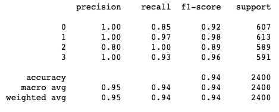
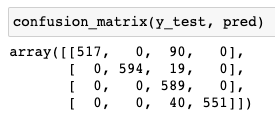

Multi classification task

1. Model metrics





2. API

to get answer replace `"PUT YOUR TEXT HERE"` with article text
```bash
curl -X POST host:port/api/classify --header 'Content-Type: application/json' \
--data-raw '{
    "text": "PUT YOUR TEXT HERE"
}'
```

3. Tests 


Test API and test classification results separately.
